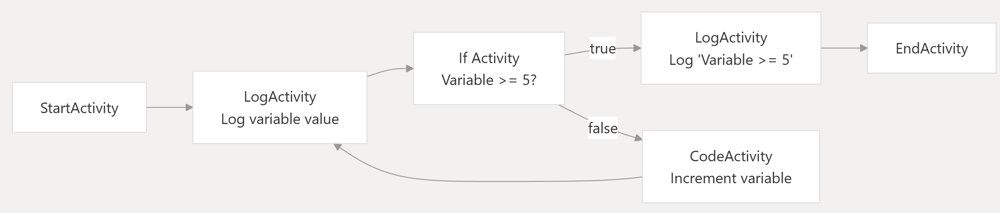

# Workflow Processor

Project insipred by [WorkflowCore](https://github.com/danielgerlag/workflow-core) and [ELSA](https://github.com/elsa-workflows/elsa-core) that allows you to build BPMN processes with C# code. 
Pros:
 * Steps (tasks) support DI in class constructor. (unlike ELSA)
 * Build connections with connectors (just like in ELSA, unlike WorkflowCore)

## Deepwiki
https://deepwiki.com/BRUS1NATOR/Workflow-Processor

## Example

### Define context
```
// Context data of process
[PolymorphicContext(typeof(Data2), "Data2")]
public class Data2 : IContextData
{
    public long Varialbe { get; set; } = 0;
}
```
### Define process
```
public class TestProcess2 : WorkflowBuilder<Data2>
{
    public TestProcess2()
    {
        Name = "Example_Test_2";
        Version = 1;
    }

    public override Workflow Build()
    {
        // ... Define scheme of the process
        return base.Build();
    }
}
```


### Define process scheme
```
public override Workflow Build()
{
    //
    var start = StepStart(); // You also can use Step<StartActivity>()
    //
    var logValue = StepLog(activity => activity.Log(context => "Variable value: " + context.Data.Varialbe));
    //
    var increaseValueByOne = StepCode(activity => activity.Code(context => { context.Data.Varialbe++; }));
    var endCycle = StepLog(activity => activity.Log("Variable value >= 5"));
    var ifStatement = StepIf(context => context.Data.Varialbe >= 5);
    var endActivity = StepEnd();

    Scheme.Connections = new List<Connection>()
        {
            new Connection(start, logValue),
            new Connection(logValue, ifStatement),
                new ConditionalConnection<Data2, bool>(ifStatement, endCycle, true),
                new ConditionalConnection<Data2, bool>(ifStatement, increaseValueByOne, false),
            new Connection(increaseValueByOne, logValue),
            new Connection(endCycle, endActivity)
        };

    return base.Build();
}
```
