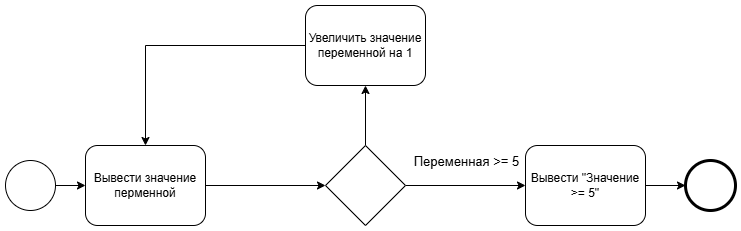

# Workflow Processor

Проект вдохновленный [WorkflowCore](https://github.com/danielgerlag/workflow-core) и [ELSA](https://github.com/elsa-workflows/elsa-core) позволяющий создавать бизнес процессы при помощи кода. 
Преимущества данного решения:
 * Задачи поддерживают внедрение зависимостей в конструкторе класса. (В отличии от ELSA)
 * Есть возможность настраивать переходы через соединениея (по аналогии с ELSA, что не доступно в WorkflowCore)

## Пример

### Определение контекста
```
// Контекстные данные процесса
public class Data : IContextData
{
    public long Varialbe { get; set; }
}
```
### Определение процесса
```
public class TestProcess : WorkflowBuilder<Data>
{
    // Метаданные процесса
    public TestProcess()
    {
        Name = "Test Process";
        Version = 1;
    }
    
    public override Workflow Build()
    {
        // Схема процесса
        ...
        return base.Build();
    }
}
```


### Определение схемы процесса
```
public override Workflow Build()
{
    // Схема процесса
    // Определеяем шаги
    var start = Step<StartActivity>();
    //
    var logValue = Step<LogActivity<Data2>>(activity => activity.Log(context => "Значение: " + context.Varialbe));
    //
    var increaseValueByOne = Step<CodeActivity<Data2>>(activity => activity.Code(context => { context.Varialbe++; }));
    var endCycle = Step<LogActivity>(activity => activity.Log("Значение >= 5"));
    var ifStatement = Step<If<Data2>>(activity =>
    {
        activity.SetCondition(context => context.Varialbe >= 5);
    });
    var endActivity = Step<EndActivity>();
    
    // Определяем соединения между шагами
    Connections = new List<Connection>()
        {
            new Connection(start, logValue),
            new Connection(logValue, ifStatement),
                new ConditionalConnection<Data2, bool>(ifStatement, endCycle, true),
                new ConditionalConnection<Data2, bool>(ifStatement, increaseValueByOne, false),
            new Connection(increaseValueByOne, logValue),
            new Connection(endCycle, endActivity)
        };

    return base.Build();
}
```